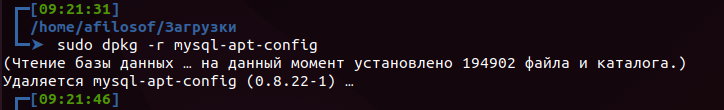
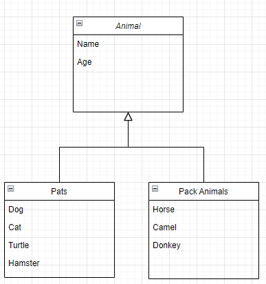
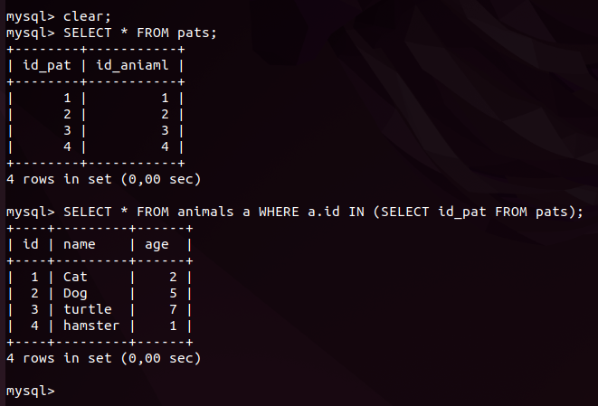
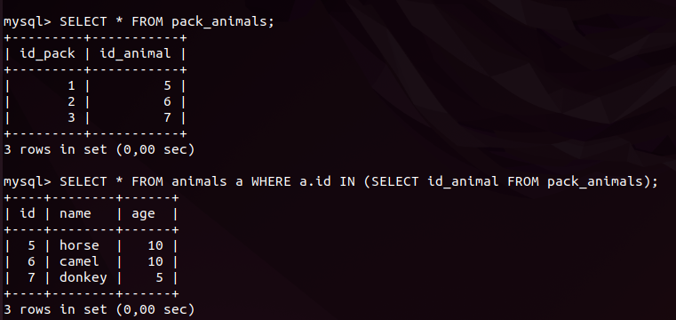
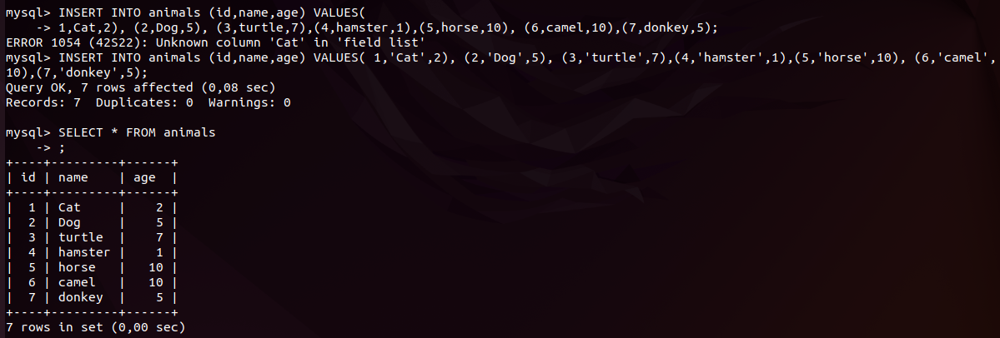
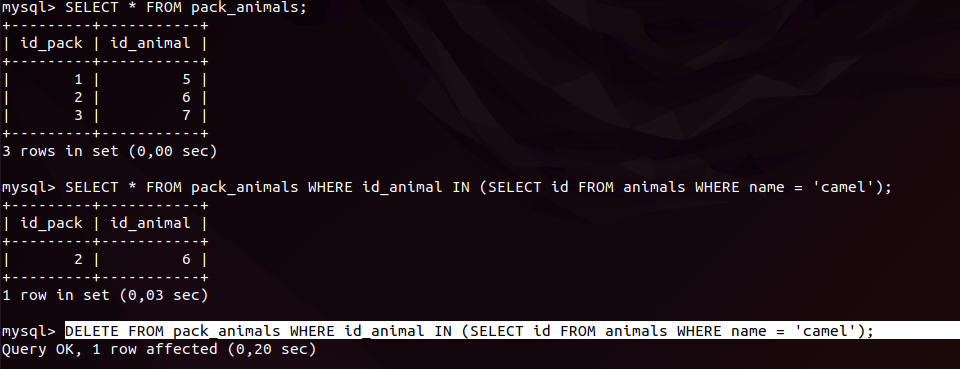
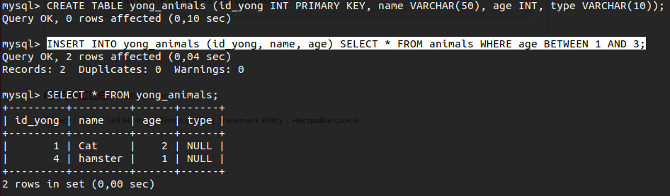
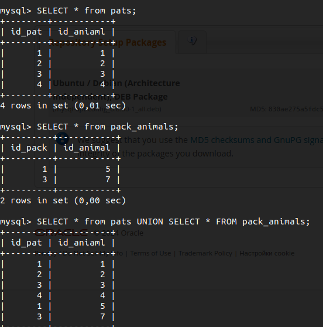
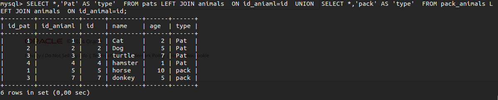
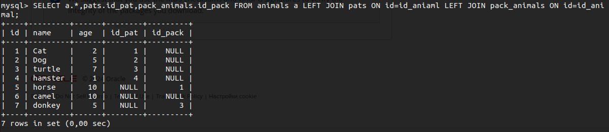

# Итоговая контрольная работа

## Информация о проекте

Необходимо организовать систему учета для питомника в котором живут
домашние и вьючные животные.
Как сдавать проект
Для сдачи проекта необходимо создать отдельный общедоступный
репозиторий (Github, gitlub, или Bitbucket). Разработку вести в этом
репозитории, использовать пул реквесты на изменения. 

Программа должна
запускаться и работать, ошибок при выполнении программы быть не должно.
Программа, может использоваться в различных системах, поэтому необходимо
разработать класс в виде конструктора

# Выполнение задания

# Ubuntu
1. Используя команду cat в терминале операционной системы Linux, создать
два файла Домашние животные (заполнив файл собаками, кошками,
хомяками) и Вьючные животными заполнив файл Лошадьми, верблюдами и
ослы), а затем объединить их. Просмотреть содержимое созданного файла.
Переименовать файл, дав ему новое имя (Друзья человека).


```
echo interim_homework
cd
mkdir int_homework_prog
cd int_homework_prog/
cat > Pats
cat Pats
cat > PackAnimals
cat PackAnimals 
cat Pats PackAnimals > HumanFriends
cat HumanFriends 
```


```
mv HumanFriends AllAnimals
ll
mv AllAnimals HumanFriends
```

2. Создать директорию, переместить файл туда.
```
mkdir Animals
mv HumanFriends Animals/
tree
```


3. Подключить дополнительный репозиторий MySQL. Установить любой пакет
из этого репозитория.
```
cd /home/afilosof/Загрузки
sudo wget https://dev.mysql.com/get/mysql-apt-config_0.8.22-1_all.deb
```


4. Установить и удалить deb-пакет с помощью dpkg.

```
sudo dpkg -i mysql-apt-config_0.8.22-1_all.deb
sudo mysql 

```


```
sudo dpkg -r mysql-apt-config
```



5. Выложить историю команд в терминале ubuntu
```
history
```


# Draw.io
6. Нарисовать диаграмму , в которой есть класс родительский класс, домашние
животные и вьючные животные, в составы которых в случае домашних
животных войдут классы: собаки, кошки, хомяки, а в класс вьючные животные
войдут: Лошади, верблюды и ослы).


#MySQL
7. В подключенном MySQL репозитории создать базу данных “Друзья
человека”
```
mysql> CREATE DATABASE human_friends_db;
mysql> USE human_friends_db;
mysql> CAREATE TABLE animals (

    -> id INT PRIMARY KEY,

    -> name VARCHAR(50),

    -> age INT);
```

8. Создать таблицы с иерархией из диаграммы в БД

```

INSERT INTO animals 
(id,name,age) 
VALUES( 1,'Cat',2), 
(2,'Dog',5), 
(3,'turtle',7),
(4,'hamster',1),
(5,'horse',10), 
(6,'camel',10),
(7,'donkey',5);
```

```
CREATE TABLE pats (id_pat INT PRIMARY KEY, id_aniaml INT);

INSERT INTO pats values(1,1),(2,2),(3,3),(4,4);

ALTER TABLE pats ADD CONSTRAINT fk_pats_animals FOREIGN KEY (id_aniaml) REFERENCES animals(id);

SELECT * FROM animals a WHERE a.id IN (SELECT id_pat FROM pats);
```



```
CREATE TABLE pack_animals (id_pack INT PRIMARY KEY, id_animal INT);

ALTER TABLE pack_animals ADD CONSTRAINT fk_pack_animals FOREIGN KEY (id_animal) REFERENCES animals(id);

INSERT INTO pack_animals values(1,5),(2,6),(3,7);

SELECT * FROM animals a WHERE a.id IN (SELECT id_pack FROM pack_animals);

```



9. Заполнить низкоуровневые таблицы именами(животных), командами
которые они выполняют и датами рождения
**done with age**



10. Удалив из таблицы верблюдов, т.к. верблюдов решили перевезти в другой
питомник на зимовку. Объединить таблицы лошади, и ослы в одну таблицу.
```
DELETE FROM pack_animals WHERE id_animal IN (SELECT id FROM animals WHERE name = 'camel');
```


11. Создать новую таблицу “молодые животные” в которую попадут все
животные старше 1 года, но младше 3 лет и в отдельном столбце с точностью
до месяца подсчитать возраст животных в новой таблице

```
CREATE TABLE yong_animals (id_yong INT PRIMARY KEY, name VARCHAR(50), age INT, type VARCHAR(10));

INSERT INTO yong_animals (id_yong, name, age) SELECT * FROM animals WHERE age BETWEEN 1 AND 3;
```


12. Объединить все таблицы в одну, при этом сохраняя поля, указывающие на
прошлую принадлежность к старым таблицам.



В моей структуре все данные и так находятся в одной таблице `animals` а таблицы `pats` и `pack_animals` используются как справочник для фильтрации основной.

```
SELECT *,'Pat' AS 'type' 
FROM pats LEFT JOIN animals 
ON id_aniaml=id 
UNION 
SELECT *,'pack' AS 'type' 
FROM pack_animals LEFT JOIN animals 
ON id_animal=id;
```



```
SELECT a.*,pats.id_pat,pack_animals.id_pack FROM animals a LEFT JOIN pats ON id=id_aniaml LEFT JOIN pack_animals ON id=id_animal;
```
**Запись NULL NULL на против camel свидетельствует что в текущих списках этого животного нет**



# JAVA
13. Создать класс с Инкапсуляцией методов и наследованием по диаграмме.
14. Написать программу, имитирующую работу реестра домашних животных.
В программе должен быть реализован следующий функционал:
14.1 Завести новое животное
14.2 определять животное в правильный класс
14.3 увидеть список команд, которое выполняет животное
14.4 обучить животное новым командам
14.5 Реализовать навигацию по меню
15.Создайте класс Счетчик, у которого есть метод add(), увеличивающий̆
значение внутренней̆  int переменной̆на 1 при нажатие “Завести новое
животное” Сделайте так, чтобы с объектом такого типа можно было работать в
блоке try-with-resources. Нужно бросить исключение, если работа с объектом
типа счетчик была не в ресурсном try и/или ресурс остался открыт. Значение
считать в ресурсе try, если при заведения животного заполнены все поля.

# Исполнение 

Все требуемые функции реализованы.


* Реализован класс `Animal`
* Наследники `Pets` и `PackAnimal` имеют уникальные свойства, домашних животных можно обучать командам, вьючным животным можно присваивать значение грузоподъёмности.
* HumanFriendsMain хранит методы работы регистратуры(работа меню).
* Запуск из класса `Main`
* Классы `Cat` и `Dog` созданы для примера расширения категорий при дальнейшем развитии регистратуры.
* Счётчик реализован в классе `Counter` используется при добавлении нового животного. Результат работы можно увидеть в пункте меню 2.


* Видео пример работы:
